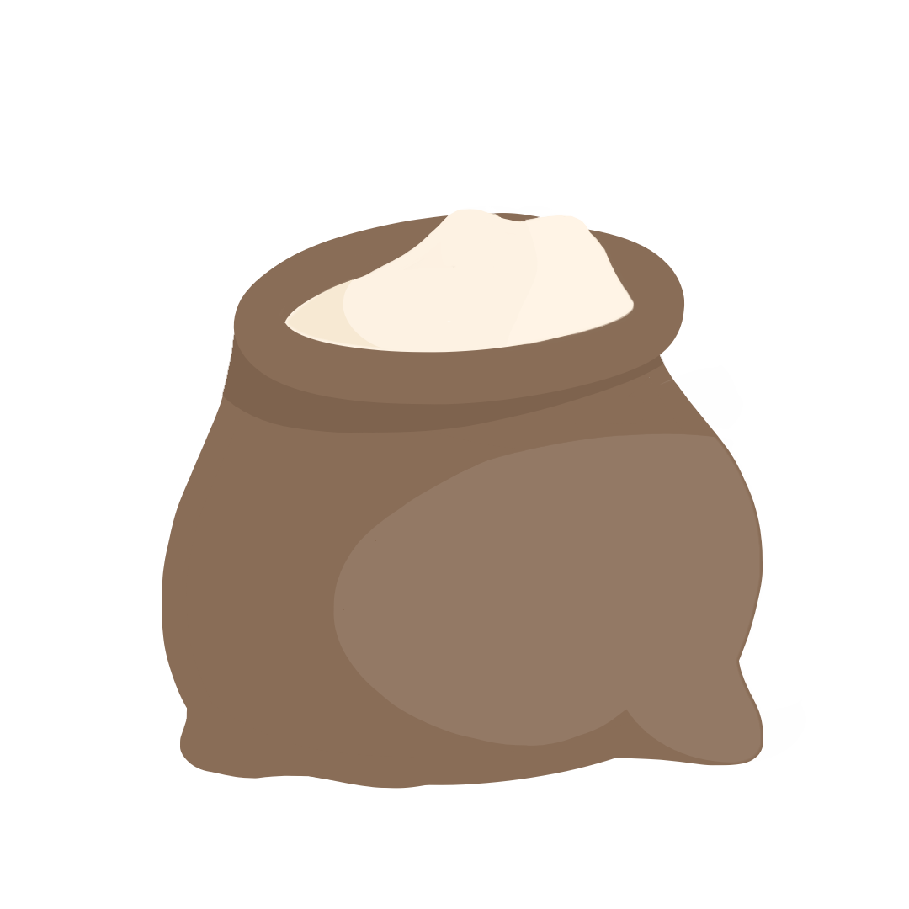

[![Contributors][contributors-shield]][contributors-url]
[![Forks][forks-shield]][forks-url]
[![Stargazers][stars-shield]][stars-url]
[![Issues][issues-shield]][issues-url]
[![Apache License][license-shield]][license-url]


<!-- PROJECT LOGO -->
<br />
<p align="center">
  <a href="https://github.com/nobody5050/sack">
    
  </a>

  <h3 align="center">Sack</h3>

  <p align="center">
    A simple, non-typed, compiled programming language!
    <br />
    <a href="https://github.com/nobody5050/sack/documentation/documentation.md"><strong>Explore the docs »</strong></a>
    <br />
    <br />
    <a href="https://github.com/nobody5050/sack/issues">Report Bug</a>
    •
    <a href="https://github.com/nobody5050/sack/issues">Request Feature</a>
  </p>
</p>


<!-- TABLE OF CONTENTS -->
<details open="open">
  <summary>Table of Contents</summary>
  <ol>
    <li>
      <a href="#about-the-project">About The Project</a>      
    </ul>
    </li>
    <li>
      <a href="#getting-started">Getting Started</a>
      <ul>
        <li><a href="#prerequisites">Prerequisites</a></li>
        <li><a href="#installation">Installation</a></li>
      </ul>
    </li>
    <li><a href="#usage">Usage</a></li>
    <li><a href="#roadmap">Roadmap</a></li>
    <li><a href="#contributing">Contributing</a></li>
    <li><a href="#license">License</a></li>
    <li><a href="#contact">Contact</a></li>
    <li><a href="#acknowledgements">Acknowledgements</a></li>
  </ol>
</details>


<!-- ABOUT THE PROJECT -->
## About The Project

Building a programming language has been a personal dream of mine for a long time, so this repo is the culmiation of about 3 years of dreams, and a weekend's work. I personally intend to use it for my future projects, and I beleive you should too.

Here's why:
* Non-Typed. 

Cast variables simply by just declaring them.
* Simple syntax.

The syntax of Sack, is heavily based on BASIC and this is no mistake. BASIC is easy to learn, and use while still having immense depth, so sack is a modernization of those same ideals.
* Highly Performant.

Since Sack compiles to C it runs close to machine code, with easy to understand while still allowing the fast speeds of bare-metal code.

At least, thats the theory. I've only started the implementation of Sack, and so at the moment it's little more than a modified implementation of BASIC with some renamed tokens. Some of the things i'll implement first include direct access to c code and a standard math library for working with more complex data structures like arrays and trees.

A list of articles, tutorials, etc that I find helpful are listed in the acknowledgements.

### Built With

Here's a few languages, libraries, and tools that I personally use to develop Sack
* [Python 3.9](https://www.python.org)
* [The C Programming Language](https://www.iso.org/standard/74528.html)
* [Numpy](https://numpy.org)
* [gcc](https://gcc.gnu.org)


<!-- GETTING STARTED -->
## Getting Started

To get started with the syntax check out the full documentation, the steps below will walk you through downloading and running the example program on a unix-like machine

### Prerequisites

First you'll need to install a few programs.
* python
  Currently the version of python that Sack uses in its compiler is 3.9.5. You can download it [here](https://www.python.org/downloads/release/python-395/)
* gcc
  You'll also want a working version of gcc, in order to run the outputted c code. 
  A branch is currently being developed which will allow interpretation on systems without gcc installed.
  You can download gcc [here](https://gcc.gnu.org)

### Installation

1. Clone the repo
   ```sh
   git clone https://github.com/nobody5050/Sack.git
   ```
2. Compile Sack to c
   ```sh
   python3 compile.py example.sk
   ```
3. Compile the `out.c` to an executable
   ```sh
   gcc -o example out.c
   ```
4. Run the executable, and see your program in action!
   ```sh
   ./example
   ```


<!-- USAGE EXAMPLES -->
## Usage

Follow the above Getting Started steps in order to compile your first Sack program. From there you can check out the documentation for Syntax and example programs. If you need help dont hesitate to ask me on discord at Nobody5050#8971

_Please refer to the [Documentation](https://github.com/nobody5050/sack/documentation/documentation.md)_


<!-- ROADMAP -->
## Roadmap

The following are planned features which will be implmented at highest priority. Features are listed in no particular order.

- [ ] Standard math functions. ROUND, PI, SIN, COS, TAN, etc
- [ ] Graphics. Drawing a window, fonts, 2D and 3D shapes, Textures
- [ ] Access to the C standard library


See also the [open issues](https://github.com/othneildrew/Best-README-Template/issues) for a list of proposed features (and known issues).


<!-- CONTRIBUTING -->
## Contributing

Contributions are what make the open source community such an amazing place to be learn, inspire, and create. Any contributions you make are **greatly appreciated**.

1. Fork the Project
2. Create your Feature Branch (`git checkout -b feature/AmazingFeature`)
3. Commit your Changes (`git commit -m 'Add some AmazingFeature'`)
4. Push to the Branch (`git push origin feature/AmazingFeature`)
5. Open a Pull Request


<!-- LICENSE -->
## License

Distributed under the MIT License. See `LICENSE` for more information.


<!-- CONTACT -->
## Contact

- [@nobody5050](https://twitter.com/nobody5050)

Project Link: [https://github.com/nobody5050/sack](https://github.com/nobody5050/sack)


<!-- ACKNOWLEDGEMENTS -->
## Acknowledgements
* [Img Shields](https://shields.io)
* [Choose an Open Source License](https://choosealicense.com)
* [Writing an interpreter in Go](https://www.amazon.com/Writing-Interpreter-Go-Thorsten-Ball/dp/3982016118/)
* [Crafting interpreters](https://craftinginterpreters.com/contents.html)


<!-- MARKDOWN LINKS & IMAGES -->
<!-- https://www.markdownguide.org/basic-syntax/#reference-style-links -->
[contributors-shield]: https://img.shields.io/github/contributors/nobody5050/sack.svg?style=for-the-badge
[contributors-url]: https://github.com/nobody5050/sack/graphs/contributors
[forks-shield]: https://img.shields.io/github/forks/nobody5050/sack.svg?style=for-the-badge
[forks-url]: https://github.com/nobody5050/sack/network/members
[stars-shield]: https://img.shields.io/github/stars/nobody5050/sack.svg?style=for-the-badge
[stars-url]: https://github.com/nobody5050/sack/stargazers
[issues-shield]: https://img.shields.io/github/issues/nobody5050/sack.svg?style=for-the-badge
[issues-url]: https://github.com/nobody5050/sack/issues
[license-shield]: https://img.shields.io/github/license/nobody5050/sack.svg?style=for-the-badge
[license-url]: https://github.com/nobody5050/sack/blob/master/LICENSE
[product-screenshot]: images/screenshot.png
